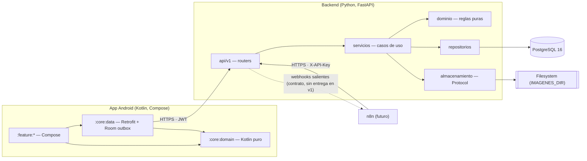
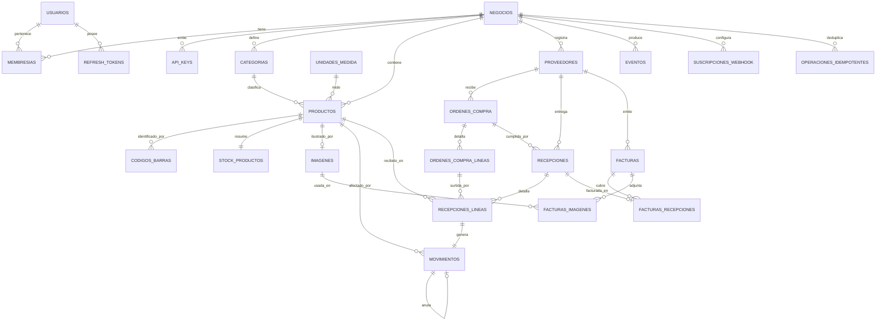

# Plan técnico — App de Inventario v1

Fase 3 · El **cómo**. Rige `constitution.md`; implementa `spec.md`.
Cada decisión referencia el `RF-`, `RN-` o `RNF-` que satisface.

---

## 0. Decisiones cerradas de esta fase

| Pendiente de `spec.md` §10 | Decisión |
|---|---|
| 1 · Almacenamiento de imágenes | **Contrato abstracto `AlmacenImagenes` con una sola implementación: filesystem.** El adaptador S3 y MinIO quedan fuera del alcance de v1. §6 |
| 2 · Origen de la tasa de cambio | **Manual**, tecleada por el usuario y congelada en el documento. `RF-COM-007`, `RN-10` |
| 3 · Método de costo actual | **Último costo recibido** en moneda base. `RF-COM-011` |
| 4 · Umbral de "sin movimiento" | **Parámetro de la consulta**, 90 días por defecto. `RF-REP-002` |
| 5 · Formato de exportación de facturas | **ZIP con CSV + imágenes** nombradas `AAAA-MM-DD_proveedor_numero.jpg`, generado con `zipfile` y `csv` de la librería estándar. La app lo descarga y lo entrega por el menú de compartir de Android. `RF-FAC-007` |
| 6 · Lista de motivos | **Fija, de semilla, con "otro" y nota obligatoria.** Sin administración por el usuario. §3.2 |
| — · Entorno de ejecución | **Local con Docker Compose**: FastAPI + PostgreSQL. La app apunta al backend por IP de red local. |

### Enmienda **E-01** a `constitution.md` §2 — representación del dinero · aprobada 2026-09-01

La constitución dice *"Dinero: entero en la unidad mínima de la moneda más su código ISO
4217"*. Chocó con un caso real: en una ferretería el costo unitario de un tornillo puede ser
**12,50 COP**, por debajo de la unidad mínima de la moneda. Redondearlo a 13 propaga error a
la valorización de `RF-REP-003` cuando se multiplica por 4.000 unidades en stock.

**Propuesta:** el dinero se almacena como `NUMERIC(18,4)` y viaja en la API como **cadena
decimal** más su código ISO 4217 (`{"monto": "12.5000", "moneda": "COP"}`). `NUMERIC` es
decimal exacto, no coma flotante, así que el espíritu de la regla — *nunca float para
dinero* — se mantiene intacto; lo que cambia es la representación. Cadena y no número JSON
para que ningún cliente lo convierta a `double` al deserializar.

**Aprobada el 2026-09-01** y registrada como **E-01** en `constitution.md`. El resto de este
documento la aplica.

---

## 1. Arquitectura general

Tres piezas y ninguna sorpresa. La app Android habla **solo** por HTTP con la API; no hay
acceso directo a la base ni a las imágenes.



**Dos decisiones estructurales sostienen todo lo demás.**

La primera: en ambos proyectos existe una **capa de dominio pura**, sin framework. En Python
es `app/dominio/`, sin SQLAlchemy ni FastAPI. En Kotlin es `:core:domain`, sin dependencias
de Android. Ahí viven las 22 reglas de `spec.md` §5, y ahí se prueban sin base de datos ni
emulador. En Android es además lo que hace viable el iOS pospuesto: ese módulo se convierte
en Kotlin Multiplatform sin reescribirse.

La segunda: **la API es la única puerta** (`RF-INT-008`). n8n entra por la misma puerta que
la app, con otra credencial. Si un flujo solo existe dentro de la app, es un defecto.

---

## 2. Backend — estructura

**Stack.** Python 3.12 · FastAPI · Pydantic v2 · SQLAlchemy 2.0 asíncrono con `asyncpg` ·
Alembic · `uvicorn`. Calidad: `ruff` y `mypy` en modo estricto sobre `dominio/` y
`servicios/`. Pruebas: `pytest`, `pytest-asyncio`, `testcontainers`, `httpx.AsyncClient`.

```
backend/
  app/
    main.py                  # ensamblado de la app, middlewares, manejadores de error
    config.py                # ajustes por entorno (pydantic-settings)
    api/
      deps.py                # contexto_actual(), paginacion(), idempotencia()
      errores.py             # traduce excepciones de dominio al formato unico (constitucion §3)
      v1/
        auth.py  negocio.py  api_keys.py
        productos.py  categorias.py  unidades.py  codigos_barras.py
        movimientos.py  conteos.py
        proveedores.py  ordenes_compra.py  recepciones.py
        facturas.py  imagenes.py
        reportes.py  eventos.py  webhooks.py
    dominio/                 # SIN SQLAlchemy, SIN FastAPI. Solo reglas.
      tipos.py               # Cantidad, Dinero, Moneda, TipoMovimiento, UnidadMedida
      movimientos.py         # RN-01..RN-07, RN-15, RN-16
      stock.py               # calculo de stock, transicion de bajo minimo (RN-22)
      compras.py             # RN-11..RN-13
      facturas.py            # RN-18
      eventos.py             # catalogo EV-* y construccion del sobre
      errores.py             # StockInsuficiente, CantidadInvalida, ... (sin HTTP)
    servicios/               # casos de uso: transaccion + reglas + repos + eventos
      movimientos.py  recepciones.py  facturas.py  productos.py
      auth.py  reportes.py  imagenes.py
    repositorios/            # acceso a datos, siempre con negocio_id explicito
    modelos/                 # SQLAlchemy declarative
    esquemas/                # Pydantic de entrada y salida
    almacenamiento/
      base.py  filesystem.py
    infra/
      db.py  seguridad.py  idempotencia.py  logging.py  paginacion.py
  alembic/versions/
  tests/
    unidad/                  # dominio puro, sin BD
    integracion/             # API + PostgreSQL real
    rendimiento/             # RNF-01..RNF-04
    conftest.py
  docker-compose.yml
  pyproject.toml
```

**La regla de dependencias es de una sola dirección**: `api → servicios → dominio`, y
`servicios → repositorios`. `dominio` no importa nada de las capas de arriba. Un `import` de
SQLAlchemy dentro de `dominio/` es un fallo de revisión, no una cuestión de gusto.

**Los servicios son los dueños de la transacción.** Un caso de uso abre la transacción,
aplica las reglas del dominio, escribe por los repositorios, **escribe el evento en la misma
transacción** (`RN-21`) y cierra. Ni los routers ni los repositorios abren transacciones.

---

## 3. Modelo de datos

### 3.1 Diagrama entidad-relación



### 3.2 Tablas y columnas relevantes

Convenciones de `constitution.md` §1 y §4: plural snake_case, PK `id UUID`, `created_at` /
`updated_at` en `timestamptz` UTC, `business_id` presente y filtrado en toda consulta
(`RN-19`). Dinero `NUMERIC(18,4)`, cantidades `NUMERIC(14,3)`, tasas `NUMERIC(18,8)`.

**Identidad y acceso** — `RF-AUT-001` a `RF-AUT-007`

| Tabla | Columnas clave | Notas |
|---|---|---|
| `usuarios` | `id`, `email` (citext, único global), `password_hash`, `nombre` | Argon2id. |
| `negocios` | `id`, `nombre`, `moneda_base` char(3), `zona_horaria` | `moneda_base` inmutable si hay movimientos valorizados (`RN-10`), verificado por trigger. |
| `membresias` | `usuario_id`, `negocio_id`, `rol` | **Tabla puente desde el día uno.** v1 crea una sola fila con rol `dueno`. Es lo que evita la migración dolorosa cuando lleguen los empleados. |
| `refresh_tokens` | `id`, `usuario_id`, `token_hash`, `familia_id`, `expira_en`, `revocado_en` | Rotación con detección de reúso: §6. |
| `api_keys` | `id`, `negocio_id`, `nombre`, `prefijo`, `secreto_hash`, `ultimo_uso_en`, `revocado_en` | Secreto mostrado una sola vez (`RF-AUT-005`). |

**Catálogo** — `RF-CAT-001` a `RF-CAT-014`

| Tabla | Columnas clave | Notas |
|---|---|---|
| `unidades_medida` | `codigo` PK, `nombre`, `tipo` (`discreta`/`continua`), `decimales` | Catálogo semilla global, no por negocio. Alimenta la validación de cantidades de `RF-INV-009` (`RN-07`). Un producto tiene una sola unidad de stock: no hay presentaciones ni factores de conversión (`RN-06`). |
| `categorias` | `id`, `negocio_id`, `nombre` | `uq_categorias_negocio_nombre`. Planas (`RF-CAT-005`). |
| `productos` | `id`, `negocio_id`, `sku`, `nombre`, `categoria_id`, `unidad_codigo`, `costo_actual`, `precio_venta`, `stock_minimo`, `imagen_id`, `estado`, `busqueda` tsvector | `uq_productos_negocio_sku` implementa `RF-CAT-002`; `costo_actual` y `precio_venta` son los valores vigentes de `RF-CAT-013`, sin historial (`RN-09`), y `stock_minimo` alimenta `RF-CAT-012`. `busqueda` es columna generada `to_tsvector('spanish', nombre‖sku‖categoria)`, índice **GIN** — así `RNF-02` se cumple con 20.000 productos. |
| `codigos_barras` | `id`, `negocio_id`, `producto_id`, `codigo` | `uq_codigos_barras_negocio_codigo` es lo que implementa `RN-05`. Índice único que además resuelve `RNF-01` con una sola lectura. |

**Movimientos y stock** — `RF-INV-001` a `RF-INV-014`

| Tabla | Columnas clave | Notas |
|---|---|---|
| `movimientos` | `id`, `negocio_id`, `producto_id`, `tipo`, `cantidad`, `motivo`, `nota`, `forzado`, `anulado_en`, `anula_movimiento_id`, `recepcion_linea_id`, `origen`, `autor_tipo`, `autor_id`, `ocurrido_en` | **Sin `UPDATE` ni `DELETE`**: un trigger `ck_movimientos_inmutables` los rechaza a nivel de base, salvo el campo `anulado_en`. Así `RN-02` no depende de que nadie se equivoque en el código. `cantidad > 0` siempre; el signo lo da `tipo` (`RN-07`, `RF-INV-009`). `autor_tipo`, `autor_id` y `ocurrido_en` son el rastro de auditoría de `RNF-13`, que ningún proceso puede borrar. |
| `motivos_movimiento` | `codigo` PK, `tipo_movimiento`, `etiqueta`, `exige_nota` bool, `orden` | **Semilla global, sin administración por el usuario** (`RF-INV-010`). entrada: `recepcion_compra` (la pone el sistema), `carga_inicial` · salida: `venta`, `consumo_interno` · merma: `rotura`, `vencimiento`, `robo`, `perdida` · ajuste: `conteo_fisico`, `correccion_carga` · contramovimiento: `anulacion`. Cada tipo lleva además `otro` con `exige_nota = true`: cubre lo excepcional sin ensuciar el agrupamiento de `RF-REP-006`. Ampliarla es una migración de datos, no una pantalla. |
| `stock_productos` | `producto_id` PK, `negocio_id`, `cantidad`, `bajo_minimo` bool, `actualizado_en` | **Instantánea materializada**, no fuente de verdad. Existe por `RNF-01` y `RNF-03`: sin ella, el stock de un producto con 12 meses de historia obliga a sumar miles de filas. `bajo_minimo` guarda el estado anterior y es lo que hace posible el antirrebote de `RN-22`. Se actualiza siempre en la misma transacción que el movimiento. Un test de reconciliación compara la suma real contra la instantánea (`RF-INV-003`). |

**Compras** — `RF-COM-001` a `RF-COM-013`

| Tabla | Columnas clave | Notas |
|---|---|---|
| `proveedores` | `id`, `negocio_id`, `nombre`, `identificacion_fiscal`, `contacto`, `telefono`, `email`, `direccion`, `notas`, `estado` | `estado` activo/archivado (`RN-17`). |
| `ordenes_compra` | `id`, `negocio_id`, `proveedor_id`, `numero`, `estado`, `fecha_esperada`, `moneda`, `motivo_cierre` | Estados de `RF-COM-003` como enum de Postgres. |
| `ordenes_compra_lineas` | `id`, `orden_id`, `producto_id`, `cantidad_ordenada`, `costo_unitario_estimado` | La cantidad pendiente se **calcula**, no se guarda: `ordenada − Σ recibida`. Un número menos que puede desincronizarse. |
| `recepciones` | `id`, `negocio_id`, `proveedor_id`, `orden_id` (nullable), `fecha`, `moneda`, `tasa_cambio`, `estado`, `confirmada_en` | `orden_id` nulo **es** `RF-COM-004`: la recepción directa no es un caso especial, es el caso normal. |
| `recepciones_lineas` | `id`, `recepcion_id`, `orden_linea_id` (nullable), `producto_id`, `cantidad_recibida`, `costo_unitario`, `moneda_costo`, `tasa_cambio`, `costo_unitario_base`, `exceso` bool | Estas cuatro columnas congeladas son toda la historia del costo (`RN-08`). Es lo que permite que `RN-09` — sin historial de precios — no deje ciego el resumen de compras. |

**Facturas** — `RF-FAC-001` a `RF-FAC-008`

| Tabla | Columnas clave | Notas |
|---|---|---|
| `facturas` | `id`, `negocio_id`, `proveedor_id`, `numero`, `fecha_emision`, `fecha_vencimiento`, `moneda`, `base_gravable`, `impuesto`, `total`, `tasa_cambio`, `total_base`, `estado_pago`, `fecha_pago` | `uq_facturas_negocio_proveedor_numero` implementa `RF-FAC-002` y `RN-18`. `ck_facturas_cuadre`: `base_gravable + impuesto = total`, comprobado por la base, no solo por Pydantic. |
| `facturas_recepciones` | `factura_id`, `recepcion_id` | `uq` sobre `recepcion_id`: una recepción en una sola factura (`RF-FAC-006`). |
| `imagenes` | `id`, `negocio_id`, `tipo`, `clave_almacenamiento`, `mime`, `bytes`, `ancho`, `alto`, `checksum` | Tabla única para producto y factura. La clave es opaca y aleatoria (`RNF-11`). |
| `facturas_imagenes` | `factura_id`, `imagen_id`, `orden` | Varias imágenes por factura (`RF-FAC-005`). |

**Integración** — `RF-INT-001` a `RF-INT-008`

| Tabla | Columnas clave | Notas |
|---|---|---|
| `eventos` | `id`, `secuencia` BIGSERIAL, `negocio_id`, `tipo`, `version`, `ocurrido_en`, `autor_tipo`, `autor_id`, `autor_nombre`, `payload` JSONB | El sobre común de todos los tipos es el de `RF-INT-003`. `secuencia` es el cursor de `RF-INT-004`: un consumidor se pone al día pidiendo `desde_secuencia`. Índice `(negocio_id, secuencia)`. |
| `suscripciones_webhook` | `id`, `negocio_id`, `url`, `tipos` text[], `secreto_hash`, `activa`, `descripcion` | Se persiste; **no se entrega en v1** (`RF-INT-005`). |
| `operaciones_idempotentes` | `negocio_id`, `clave`, `endpoint`, `hash_peticion`, `status`, `respuesta` JSONB | `uq(negocio_id, clave)`. Genérica: sirve a movimientos, recepciones y facturas (`RN-20`). |

### 3.3 Índices que sostienen los requisitos no funcionales

| Índice | Sostiene |
|---|---|
| `uq_codigos_barras_negocio_codigo` | `RNF-01` — escaneo en < 300 ms |
| `ix_productos_busqueda` GIN sobre tsvector | `RNF-02` — búsqueda por texto < 500 ms |
| `ix_movimientos_producto_ocurrido (producto_id, ocurrido_en DESC, id DESC)` | `RF-INV-012`, historial paginado por cursor |
| `ix_movimientos_negocio_ocurrido` | `RF-REP-005`, `RF-REP-006` por rango de fechas |
| `ix_stock_bajo_minimo (negocio_id) WHERE bajo_minimo` | `RF-REP-001` — parcial, se lee solo lo alertado |
| `ix_eventos_negocio_secuencia` | `RF-INT-004` |

### 3.4 Migraciones

Alembic, una migración por cambio, nunca editada después de aplicarse
(`constitution.md` §4). Cada una con `downgrade` funcional. Los enums de Postgres se crean y
se eliminan explícitamente en ambos sentidos, que es donde Alembic falla en silencio si no
se escribe a mano. La semilla de `unidades_medida` va en una migración de datos, no en un
script suelto, para que una base recién creada sea utilizable.

Cambios destructivos en dos despliegues: expandir, migrar datos, contraer. En v1 no debería
hacer falta ninguno; la regla está escrita para cuando lo haga.

---

## 4. Contrato de la API

**Convenciones** (`constitution.md` §2): prefijo `/api/v1`, recursos en plural, JSON
snake_case, fechas ISO 8601 UTC, dinero como cadena decimal más `moneda`, toda colección
paginada por cursor (`?cursor=&limit=`, máx. 100), toda escritura de negocio acepta
`Idempotency-Key`. El documento OpenAPI se genera de los modelos Pydantic (`RNF-17`).

### 4.1 Endpoints

| Método y ruta | Qué hace | Requisitos |
|---|---|---|
| `POST /auth/registro` | Crea usuario + negocio + membresía y devuelve tokens | `RF-AUT-001` |
| `POST /auth/login` · `POST /auth/refresh` · `POST /auth/logout` | Sesión | `RF-AUT-002`, `RF-AUT-003` |
| `PATCH /auth/password` | Cambia contraseña y revoca refresh tokens | `RF-AUT-006` |
| `GET` · `PATCH /negocio` | Datos y moneda base del negocio | `RF-AUT-004` |
| `GET` · `POST /api-keys` · `DELETE /api-keys/{id}` | Credenciales de servicio | `RF-AUT-005` |
| `GET /unidades-medida` | Catálogo de unidades | `RF-CAT-004` |
| `GET` · `POST /categorias` · `PATCH /categorias/{id}` | Categorías | `RF-CAT-005` |
| `GET /productos` | Listado paginado; filtros `categoria_id`, `estado`, `condicion_stock` | `RF-CAT-014` |
| `POST /productos` · `GET` · `PATCH /productos/{id}` | Alta, ficha y edición | `RF-CAT-001`, `RF-CAT-010` |
| `POST /productos/{id}/archivar` · `/desarchivar` | Sustituye al borrado | `RF-CAT-011`, `RN-17` |
| `GET /productos/buscar?q=` | Búsqueda por texto | `RF-CAT-007` |
| `GET /productos/por-codigo/{codigo}` | Escaneo. **404 con cuerpo que incluye el código consultado**, para que la app ofrezca el alta precargada sin una segunda llamada | `RF-CAT-008`, `RF-CAT-009`, `RN-14` |
| `POST /productos/{id}/codigos-barras` · `DELETE .../{codigo}` | Varios códigos por producto | `RF-CAT-003` |
| `PUT /productos/{id}/imagen` | Sube o reemplaza la foto (multipart) | `RF-CAT-006` |
| `POST /movimientos` | **Registra un movimiento.** Acepta `forzar: true` para el override | `RF-INV-001`, `RF-INV-005`, `RF-INV-006`, `RF-INV-011` |
| `GET /movimientos` · `GET /movimientos/{id}` | Consulta y filtros | `RF-INV-002` |
| `POST /movimientos/{id}/anular` | Crea el contramovimiento | `RF-INV-008` |
| `POST /productos/{id}/conteo` | Ajuste por cantidad contada; el servidor calcula el delta | `RF-INV-013`, `RN-15` |
| `GET /productos/{id}/movimientos` · `/stock` | Historial paginado y exportable, y stock actual | `RF-INV-012`, `RF-INV-003`, `RF-REP-004` |
| `GET` · `POST /proveedores` · `PATCH` · `POST /{id}/archivar` | Proveedores | `RF-COM-001` |
| `GET` · `POST /ordenes-compra` · `PATCH /{id}` | Órdenes en borrador | `RF-COM-002` |
| `POST /ordenes-compra/{id}/emitir` · `/cancelar` · `/cerrar-con-faltante` | Transiciones de estado | `RF-COM-003`, `RF-COM-008`, `RF-COM-010` |
| `POST /recepciones` · `PATCH /{id}` | Recepción en borrador, con o sin `orden_id` | `RF-COM-004`, `RF-COM-005` |
| `POST /recepciones/{id}/confirmar` | **Genera las entradas atómicamente**, congela costos, actualiza estado de la orden | `RF-COM-006` a `RF-COM-009`, `RF-COM-011`, `RF-COM-012`, `RN-12`, `RN-13` |
| `GET /recepciones` | Listado con filtros | `RF-COM-013` |
| `GET` · `POST /facturas` · `PATCH /{id}` | Facturas de compra | `RF-FAC-001` a `RF-FAC-003` |
| `POST /facturas/{id}/pagar` | Marca pagada con fecha | `RF-FAC-004` |
| `POST /facturas/{id}/imagenes` · `DELETE` | Adjuntos del documento | `RF-FAC-005` |
| `GET /facturas/exportacion?desde=&hasta=` | Listado + URLs de las imágenes del período | `RF-FAC-007` |
| `GET /imagenes/{id}` | Redirección a URL temporal firmada | `RNF-11` |
| `GET /reportes/bajo-minimo` · `/agotados` · `/sin-movimiento` · `/valorizacion` · `/compras` · `/mermas` · `/discrepancias` | Los siete reportes | `RF-REP-001`, `RF-REP-007`, `RF-REP-002`, `RF-REP-003`, `RF-REP-005`, `RF-REP-006`; todos paginados y accesibles por API (`RF-REP-008`) |
| `GET /eventos?desde_secuencia=&tipo=` | Eventos de dominio paginados | `RF-INT-004` |
| `GET` · `POST /webhooks` · `DELETE /webhooks/{id}` | Suscripciones (sin entrega en v1) | `RF-INT-005` |

**Paridad `RF-INT-008`.** Toda la tabla es accesible tanto con `Authorization: Bearer` como
con `X-API-Key`. No hay endpoints exclusivos de la app ni exclusivos de servicio.

### 4.2 Forma de las respuestas

Colección paginada:

```json
{ "datos": [ ... ], "cursor_siguiente": "eyJvIjoi...", "tiene_mas": true }
```

Error, formato único de `constitution.md` §3:

```json
{ "error": { "code": "STOCK_INSUFICIENTE",
             "message": "Solo hay 2 unidades de Cuaderno 100 hojas.",
             "details": { "producto_id": "...", "solicitado": "5.000",
                          "disponible": "2.000", "puede_forzar": true } } }
```

`details.puede_forzar` es lo que permite a la app ofrecer el override de `RF-INV-006` y
`RN-04` sin adivinar. Códigos principales: `STOCK_INSUFICIENTE` (409), `CODIGO_BARRAS_DUPLICADO` (409),
`FACTURA_DUPLICADA` (409), `MOVIMIENTO_YA_ANULADO` (409), `RECEPCION_INMUTABLE` (409),
`CANTIDAD_INVALIDA_PARA_UNIDAD` (422), `FACTURA_NO_CUADRA` (422), `PRODUCTO_NO_ENCONTRADO`
(404), `CREDENCIAL_INVALIDA` (401).

### 4.3 Idempotencia

Toda escritura de negocio (`POST /movimientos`, `/conteo`, `/anular`, `/recepciones/{id}/confirmar`,
`POST /facturas`) exige `Idempotency-Key`. El servidor guarda en
`operaciones_idempotentes` la clave, el hash del cuerpo y la respuesta.

- Misma clave y mismo cuerpo → devuelve la respuesta guardada, sin volver a ejecutar.
- Misma clave y **cuerpo distinto** → `409 CLAVE_IDEMPOTENCIA_REUTILIZADA`. Es el caso que
  protege de un bug del cliente, no de un reintento legítimo.
- Petición en curso con la misma clave → `409 OPERACION_EN_CURSO`.

Esto es lo que hace verdadera la promesa de `RNF-06`: el reintento del cliente no puede
duplicar un movimiento.

### 4.4 Concurrencia y consistencia del stock

`RF-INV-004` exige que el stock consultado y el derivado coincidan **incluso con escrituras
simultáneas sobre el mismo producto**. El caso de uso hace, dentro de una transacción:

1. `SELECT ... FROM stock_productos WHERE producto_id = :id FOR UPDATE` — serializa a los
   competidores sobre esa fila y solo sobre esa.
2. Valida las reglas del dominio con el stock ya bloqueado (`RN-03`, `RN-07`).
3. `INSERT` del movimiento.
4. `UPDATE` de la instantánea de stock.
5. Detecta la transición de mínimo y emite `EV-stock.bajo_minimo` solo si cruzó
   (`RN-22`), comparando contra `bajo_minimo` guardado.
6. `INSERT` de `EV-movimiento.registrado` (`RN-21`).
7. `COMMIT`.

El bloqueo es por producto, así que dos movimientos de productos distintos no se estorban.
Sin el paso 1, dos salidas simultáneas de un producto con 3 unidades podrían pasar ambas la
validación y dejar el stock en −2 sin que nadie lo forzara.

---

## 5. Autenticación y autorización

**Token de acceso**: JWT HS256, 15 minutos, con `sub` (usuario), `biz` (negocio), `typ`,
`jti`, `exp`. Corto a propósito: no se revoca, caduca.

**Token de renovación**: valor opaco de 256 bits, **nunca un JWT**. Se guarda solo su hash.
Vida de 60 días, **rotación en cada uso**: al renovar se emite uno nuevo y se revoca el
anterior. Si llega un token ya revocado, se revoca **toda la familia** — es la señal de que
alguien copió el token. Con esto, `RF-AUT-003` da 30 días de sesión sin reautenticar en el
celular sin dejar un token eterno rondando (`RNF-11`).

**Credencial de servicio** (`RF-AUT-005`): cabecera `X-API-Key` con formato
`inv_<prefijo8>_<secreto>`. El prefijo se guarda en claro para localizar la fila; el secreto
se guarda con hash Argon2id y se muestra al usuario **una sola vez**.

**Contexto de negocio.** Una única dependencia de FastAPI, `contexto_actual()`, resuelve
ambos mecanismos y devuelve `ContextoNegocio(negocio_id, autor)`. Todos los repositorios
reciben `negocio_id` como parámetro obligatorio; no hay consulta que no lo lleve (`RN-19`).
Un recurso de otro negocio responde **404, nunca 403** (`RF-AUT-007`): un 403 confirmaría que
el recurso existe.

**Contraseñas**: Argon2id con los parámetros por defecto de `argon2-cffi` (`RNF-11`).

---

## 6. Manejo de imágenes

Decisión: **un contrato abstracto con una sola implementación.** El `Protocol` se paga porque
aísla a los servicios del almacén concreto; la segunda implementación no se paga, porque el
despliegue es local y un adaptador S3 nunca se ejercería fuera de sus propios tests.

```python
class AlmacenImagenes(Protocol):
    async def guardar(self, clave: str, contenido: bytes, mime: str) -> None: ...
    async def url_de_lectura(self, clave: str, ttl: timedelta) -> str: ...
    async def borrar(self, clave: str) -> None: ...
```

**`AlmacenFilesystem`** — única implementación de v1. Escribe bajo `IMAGENES_DIR` con la clave
opaca como ruta. La URL de lectura es `/api/v1/imagenes/{id}?t=<token HMAC con caducidad>`,
servida por FastAPI, que es lo que le da caducidad y la hace no adivinable (`RNF-11`).

**Una sola ruta de subida.** El cliente sube por multipart a la API
(`PUT /productos/{id}/imagen`, `POST /facturas/{id}/imagenes`). El archivo pasa por el
backend; con ≤ 1,5 MB (`RNF-05`) es irrelevante.

**El `Protocol` se prueba como contrato, no como detalle.** Los tests del almacén se escriben
contra la interfaz, nunca contra `AlmacenFilesystem`, y una comprobación verifica que ningún
módulo de `servicios/` importe la implementación concreta. Es lo que mantiene la abstracción
honesta con un solo adaptador: sin esa disciplina, el `Protocol` se convierte en decoración y
añadir S3 más tarde deja de ser barato.

**El adaptador S3 queda fuera del alcance de v1.** Si algún día el backend sale de la máquina
local, es una tarea aislada — implementar el `Protocol` con `boto3` y cambiar una variable de
entorno — sin tocar servicios, API ni modelo de datos.

**Compresión en el cliente** (`RNF-05`, lo hace Android): producto lado mayor 1280 px, ≤ 300
KB, JPEG calidad ~80. Factura lado mayor 2048 px, ≤ 1,5 MB, calidad ~85, **sin recorte
automático** — Don Julio tiene que leer el número sin ampliar. El servidor **verifica y
rechaza** lo que exceda: la validación del cliente es una comodidad, no una garantía.

Las claves de almacenamiento son aleatorias y opacas, y las URLs de lectura caducan a los 15
minutos (`RNF-11`). Nada se depura automáticamente: las imágenes de factura y el historial de
movimientos se conservan al menos cinco años (`RNF-16`), así que borrar una imagen solo ocurre
cuando el usuario reemplaza la foto de un producto.

---

## 7. Eventos y webhooks

Los eventos se escriben **en la misma transacción que el hecho** (`RN-21`), desde el
servicio. `app/dominio/eventos.py` construye el sobre de `spec.md` §6 y es el único sitio
donde se decide qué campos lleva cada tipo.

En v1 solo se persisten y se consultan (`RF-INT-004`). Esto es una **bandeja de salida
transaccional** en todo menos el nombre: el día que se implemente la entrega, un proceso
aparte lee `eventos` por `secuencia` y publica, sin tocar una sola línea del productor. Por
eso `secuencia` es `BIGSERIAL` y no un timestamp.

Las suscripciones se dan de alta y se guardan (`RF-INT-005`); la firma HMAC (`RF-INT-006`) y
los reintentos con semántica *al menos una vez* (`RF-INT-007`) están definidos en `spec.md`
§6 y **no se implementan** en v1.

El catálogo de eventos es parte del contrato (`RF-INT-002`): añadir un tipo nuevo no rompe
compatibilidad, pero cambiar el significado de un payload existente o quitarle un campo sí, y
exige subir la `version` del sobre.

---

## 8. App Android

### 8.1 Módulos

```
android/
  app/                       # Application, MainActivity, NavHost, wiring de Hilt
  core/
    domain/                  # KOTLIN PURO. Sin android.*  <- futuro KMP
      modelo/                # Producto, Movimiento, Recepcion, Dinero, Cantidad
      regla/                 # validacion de cantidad por unidad (RN-07), cuadre (RN-18)
      caso/                  # RegistrarSalida, ConfirmarRecepcion, AjustarPorConteo
      repositorio/           # INTERFACES, sin implementacion
    data/                    # Retrofit, DTOs, mapeadores, Room (outbox), impl. de repos
    designsystem/            # tema, tipografia, componentes (BotonPrincipal, CampoCantidad)
    common/                  # Resultado<T>, utilidades de error
  feature/
    auth/  catalogo/  escaneo/  movimientos/  compras/  facturas/  reportes/
```

**`core:domain` no depende de Android ni de Retrofit.** Declara las interfaces de
repositorio; `core:data` las implementa. Esta inversión es lo que hace real el "iOS
pospuesto, no descartado": el módulo se vuelve KMP sin reescribirse.

### 8.2 Librerías y por qué

| Necesidad | Elección | Por qué esta y no otra |
|---|---|---|
| Cliente HTTP | **Retrofit 2 + OkHttp 4 + kotlinx.serialization** | El interceptor y el `Authenticator` de OkHttp resuelven la renovación de JWT (`RF-AUT-003`) y el reintento con espera creciente en un solo sitio, que es exactamente lo que `RNF-06` necesita. Ktor Client sería mejor para KMP, pero la capa de datos se reescribe igual al migrar; el dominio, que es lo que se conserva, no depende de ninguno de los dos. |
| Inyección de dependencias | **Hilt** | Verificación en tiempo de compilación e integración directa con `ViewModel` y Navigation Compose. Koin es más simple de escribir, pero convierte un error de grafo en un fallo en ejecución, delante del usuario. |
| Serialización | **kotlinx.serialization** | Sin reflexión ni procesamiento de anotaciones en tiempo de ejecución; arranque más rápido, que cuenta para `RNF-10`. |
| Persistencia local | **Room** | Solo para la **bandeja de salida** de escrituras pendientes (§8.5) y la caché del último catálogo consultado. Room da migraciones y consultas verificadas en compilación. DataStore sería insuficiente: hay que consultar por estado y ordenar. |
| Navegación | **Navigation Compose con rutas tipadas** | Rutas como objetos serializables en vez de cadenas: los argumentos se verifican en compilación. |
| Imágenes | **Coil 3** | Nativo de Compose y comparte el `OkHttpClient`, así que reutiliza la conexión y la cabecera de autenticación. |
| Cámara y escaneo | **CameraX + ML Kit Barcode Scanning (modelo empaquetado)** | CameraX absorbe las diferencias entre fabricantes, que en gama media son muchas. El modelo **empaquetado** en vez del de Play Services pesa ~2,5 MB más pero funciona en el primer arranque y sin red — decisivo en la bodega del fondo (`RNF-10`). |
| Pruebas | **JUnit4 + Turbine + MockK + kotlinx-coroutines-test** | Turbine es lo que hace legible probar un `StateFlow`. |

`minSdk 24` (Android 7.0), `targetSdk` y `compileSdk` en la última estable
(`RNF-14`). `coreLibraryDesugaring` activado para usar `java.time` en API 24-25.

### 8.3 Estado en Compose

Flujo unidireccional, sin excepciones. Cada pantalla tiene un `ViewModel` que expone **un**
`StateFlow<XxxUiState>`, donde `UiState` es un `data class` con los datos, `cargando` y
`error`. La UI la consume con `collectAsStateWithLifecycle()` para no recolectar en segundo
plano. Los Composables no llaman a repositorios ni lanzan corrutinas propias.

Los sucesos de una sola vez — navegar, mostrar un aviso — **no** van en el estado: van por un
`Channel` expuesto como `Flow`, para que no se repitan al rotar la pantalla.

Los Composables de presentación son sin estado y reciben datos más lambdas. Es lo que permite
previsualizarlos y probarlos sin levantar el grafo de dependencias.

`core:designsystem` fija de una vez el tamaño mínimo de texto en 16 sp, el área táctil en
48×48 dp y el contraste WCAG AA (`RNF-08`, `RNF-09`). Al estar en los componentes compartidos
y no en cada pantalla, ninguna pantalla puede incumplirlos por descuido.

### 8.4 Cámara, escaneo y permisos

**Ciclo de vida.** `ProcessCameraProvider` se vincula al `LifecycleOwner` de la pantalla, no
a la Activity, así que se libera al salir. En Compose, `DisposableEffect` cierra el
`BarcodeScanner` y desvincula los casos de uso en `onDispose`. `ImageAnalysis` con
`STRATEGY_KEEP_ONLY_LATEST` para no acumular fotogramas cuando el reconocimiento se retrasa.
`ImageProxy.close()` en `finally`, siempre: no cerrarlo congela el análisis tras unos pocos
fotogramas, y es el fallo más común de esta integración.

**Antirrebote de lectura.** El mismo código leído dos veces en menos de 1,5 s se ignora. Sin
esto, apuntar a una etiqueta dispara veinte lecturas del mismo producto.

**Linterna.** Interruptor de linterna en la pantalla de escaneo. La bodega está al fondo y
tiene poca luz; sin esto el escaneo falla justo donde más se usa.

**Permisos** (`RNF-15`). Solo se pide `CAMERA`, con explicación **antes** del diálogo del
sistema y en el momento de usarla, no al arrancar. Si se deniega, la pantalla ofrece teclear
el código a mano y **todos los flujos siguen completándose**. No se pide ningún permiso de
almacenamiento: las fotos se capturan con `ImageCapture` al directorio de caché de la app,
que no requiere permiso en ninguna versión soportada, y se borran tras subirse.

### 8.5 Red, errores y la bandeja de salida

`RNF-06` y `RNF-07` son requisitos de cliente tanto como de servidor.

Cada escritura de negocio genera un **UUID de idempotencia en el momento en que Marta
confirma**, no en el momento de enviar. Se guarda con la operación en la tabla de bandeja de
salida de Room, se envía, y se marca confirmada cuando el servidor responde. Si la app muere
a mitad, al arrancar reintenta lo pendiente **con la misma clave**, y el servidor devuelve el
movimiento ya creado en lugar de duplicarlo.

La UI nunca muestra éxito antes de la confirmación del servidor. Un fallo de red dice *"No se
guardó. Reintentando…"* con la opción de reintentar a mano. Un 5xx muestra un mensaje llano y
el identificador de la petición. El mapeo de errores vive en un solo sitio, `core:common`,
que traduce el `code` de la API al texto en español: nunca se muestra el `message` crudo del
servidor sin pasar por ahí.

**Esto no es el modo sin conexión.** Es la garantía de que una escritura ya confirmada por
Marta llegue. La cola de sincronización completa está fuera del alcance de v1, y esta tabla
es precisamente su semilla.

---

## 9. Plan de pruebas

| Nivel | Qué cubre | Herramientas |
|---|---|---|
| **Unidad — dominio Python** | Las 22 reglas de `spec.md` §5, sin base de datos. Cada test nombra su regla: `test_rn_03_salida_mayor_que_stock_se_rechaza` | pytest |
| **Integración — API** | Cada `RF-` con al menos un test que lo nombra, contra **PostgreSQL real** en contenedor, nunca SQLite | pytest, testcontainers, httpx |
| **Concurrencia** | N salidas simultáneas del mismo producto: el stock nunca queda negativo sin forzar (`RF-INV-004`) | pytest-asyncio |
| **Idempotencia** | La misma operación enviada 5 veces con la misma clave produce **un** movimiento (`RNF-06`, `RN-20`) | pytest |
| **Reconciliación** | La instantánea `stock_productos` coincide con la suma de movimientos tras una batería aleatoria de operaciones (`RF-INV-003`) | pytest |
| **Contrato de almacenamiento** | Tests escritos contra el `Protocol`, más la comprobación de que ningún servicio importa la implementación concreta | pytest |
| **Rendimiento** | Semilla de 20.000 productos y 180.000 movimientos; medición de p95 para `RNF-01` a `RNF-04`. Falla el build si se excede | pytest-benchmark, script de semilla |
| **Unidad — dominio Kotlin** | Reglas y casos de uso de `core:domain`, en JVM, sin emulador | JUnit, MockK |
| **ViewModels** | Transiciones de estado y sucesos únicos | Turbine, coroutines-test |
| **Instrumentado** | **Solo** escaneo y captura de foto: lo que no se puede probar sin cámara real | Compose UI Test |

No se persigue un porcentaje de cobertura: se persigue que **ningún `RF-` quede sin test**
(`constitution.md` §5). La suite completa por debajo de 5 minutos.

**Revisión manual de paridad** (`RF-INT-008`): al cerrar cada tarea que añade una capacidad a
la app, se comprueba que existe el endpoint equivalente accesible con `X-API-Key`. Es un
punto del criterio de "hecho", no un test automático.

---

## 10. Entorno de desarrollo

`docker-compose.yml` levanta todo con un comando: **PostgreSQL 16** y el **backend** con
recarga automática. Las migraciones se aplican al arrancar el contenedor del backend. Las
imágenes van a un volumen montado en `IMAGENES_DIR`, que se respalda copiando la carpeta.

La app Android apunta al backend por la IP de la máquina en la red local, configurada como
`buildConfigField` por variante. La variante de depuración permite HTTP en claro mediante una
configuración de seguridad de red limitada a esa IP; la de release, no.

---

## 11. Trazabilidad de las decisiones técnicas

| Decisión | Requisitos que satisface |
|---|---|
| Capa `dominio` pura en ambos proyectos | `RN-01` a `RN-22`, iOS pospuesto |
| Instantánea `stock_productos` | `RNF-01`, `RNF-03`, `RF-INV-004` |
| `SELECT … FOR UPDATE` por producto | `RF-INV-004`, `RN-03` |
| Trigger de inmutabilidad de movimientos | `RN-02`, `RF-INV-007` |
| `uq_codigos_barras_negocio_codigo` | `RNF-01`, `RN-05` |
| Columna generada tsvector + índice GIN | `RNF-02`, `RF-CAT-007` |
| Tabla `operaciones_idempotentes` | `RNF-06`, `RN-20`, `RF-INV-011` |
| Costos congelados en `recepciones_lineas` | `RN-08`, `RN-09`, `RF-REP-005` |
| `eventos.secuencia` BIGSERIAL | `RF-INT-004`, futura entrega de webhooks |
| Tabla puente `membresias` | `RN-19`, multi-usuario futuro |
| 404 en lugar de 403 entre negocios | `RF-AUT-007`, `RNF-12` |
| Rotación de refresh con detección de reúso | `RF-AUT-003`, `RNF-11` |
| `Protocol AlmacenImagenes` con adaptador único de filesystem | `RF-CAT-006`, `RF-FAC-005`, `RNF-11` |
| Bandeja de salida en Room | `RNF-06`, `RNF-07`, `HU-19` |
| ML Kit con modelo empaquetado | `RNF-10`, `RNF-15` |
| `collectAsStateWithLifecycle` + sucesos por `Channel` | `RNF-08`, `RNF-10` |

---

## 12. Pendientes

**Ninguno.** Los cuatro pendientes que arrastraba `spec.md` §10 y los tres de la primera
versión de este documento están resueltos e incorporados: almacenamiento de imágenes (§6),
tasa de cambio y costo actual (§0), formato de exportación (§0), lista de motivos (§3.2) y la
enmienda **E-01** sobre el dinero, aprobada el 2026-09-01 y registrada en `constitution.md`.
